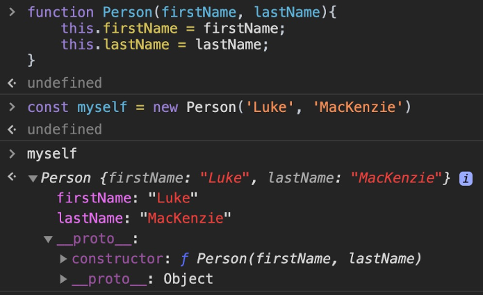
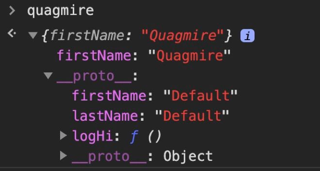

## 1. Object literal

The first and most easily understood way to create an object is to literally just write one (hence, object literal). Here’s an example:

```javascript
const person = { firstName: 'Luke', lastName: 'MacKenzie' };
```

This is much easier and cleaner than using the `Object()` constructor function, which would be done like this:

```javascript
const person = new Object();
person.firstName = 'Luke';
person.lastName = 'MacKenzie';
```

This brings us to the next way of creating objects:

## 2. The `new` keyword

In the above example, we used the new keyword with a built-in constructor function, `Object()`. This is not recommended for a few reasons:

- If you only need to create a single, one-off object, it’s more code with no added benefit.
- If you potentially need to create a large number of objects, you’d have to manually add the properties to every object. Imagine if we had hundreds or thousands of objects.
- It requires an additional process called "scope resolution" behind the scenes to figure out if the constructor is built-in or user-defined.

So if the built-in `Object()` constructor is no good, what do you do? Well, you write your own. Take a look at the example below:

```javascript
function Person(firstName, lastName) {
  this.firstName = firstName;
  this.lastName = lastName;
  // notice how we don’t return anything (more on this below)
}
```

<div class="callout info">
Before I forget, it’s important to point out that capitalizing the first letter of the function name is simply a convention. That said, it’s one I’d highly encourage you to obey as it will help you and especially other developers who look at your code know which functions are intended to be used as constructors.
</div>

Getting back to the example, we can now use our constructor function like so:

```javascript
const myself = new Person('Luke', 'MacKenzie');
```

A few things happen when we use the `new` keyword with a constructor function:

- A brand new empty object gets created.
- The `this` keyword gets set to that empty object.
- `return this` gets added to the end of the function. This is why it’s important that we do not write our own return statement within constructor functions.
- Adds a property onto the empty object called `__proto__`, which links the prototype property on the constructor function to the empty object.

To see this more clearly, take a look at what we get from our previous example:



As you can see, our `Person` constructor created a brand new object, added the `firstName` and `lastName` properties to it, and then returned it.

This covers points 1, 2, and 3 of the list above, so let’s dig into number 4 a bit.

To reiterate the point, whenever we use the new keyword to create an object, that object automatically gets a `__proto__` property. This `__proto__` property simply links our new object to the prototype of the constructor function, giving us access to any properties and methods that live on that prototype.

<div class="callout success">
  <strong>WHAT'S A PROTOTYPE?</strong>
  Prototypes are the mechanism by which JavaScript objects inherit features from one another. Every function has a `prototype` property that starts as an empty object and is never used unless the function is used as a constructor. An important distinction to remember is that the prototype property on a function holds the prototype used for instances created through it. The actual prototype of the constructor function is Function.prototype since, after all, it's just a function.
</div>

Continuing with our example, here’s proof that I’m not lying to you:

```javascript
myself.__proto__ === Person.prototype;
// true

// alternatively, since __proto__ is technically deprecated, you could do this:

Object.getPrototypeOf(myself) === Person.prototype;
// true
```

This becomes super powerful when we want to share methods across objects, like so:

```javascript
function Person(firstName, lastName) {
  this.firstName = firstName;
  this.lastName = lastName;
}

Person.prototype.logHi = function () {
  console.log(`Hi, ${this.firstName}`);
};

const stewie = new Person('Stewie', 'Griffin');
stewie.logHi(); // "Hi, Stewie"

// now, we can keep adding methods to the Person prototype
// and our 'stewie' object (along with any other objects created with the Person constructor)
// will have access to those methods

Person.prototype.logBye = function () {
  console.log(`Bye, ${this.firstName}`);
};

stewie.logBye(); // "Bye, Stewie"
```

You might be wondering, can't we just add the methods within the constructor, like this:

Technically, you can. That said, if we use this version of the Person constructor to create 100 people, the `logHi` function will be created 100 times which certainly isn't optimal from a memory perspective. Instead, when we add the method to the Person prototype, the function is only ever created once and would be shared across the 100 people objects.

**As a general rule**, methods should be added to the prototype while properties should be set up inside the constructor since they will often have different values.

## 3. Object.create()

To start, let's quickly convert our `Person` constructor function to a regular object:

```javascript
const person = {
  firstName: 'Default',
  lastName: 'Default',
  logHi: function () {
    console.log(`Hi, ${this.firstName}`);
  }
};

// ASIDE
// the logHi method above could have been defined with this shorthand:
const person = {
  logHi() {
    console.log(`Hi, ${this.firstName}`);
  }
};
```

Now, since this is no longer a constructor function, we can't use the new keyword. Instead, **the idea here is to use this person object as the prototype, or the "base object", for other objects**. By doing so, we can simply modify or add to this object at any point in our application and any objects with the person object as its prototype will be able to access its properties and methods. That may sound a bit confusing so let's look at some code:

```javascript
const quagmire = Object.create(person);
```

With this single line of code, we've created a new object called `quagmire`, and set its prototype to be the `person` object. As a result, even though the quagmire object is technically empty, we can do this:

```javascript
quagmire.logHi(); // "Hi, Default"
```

Okay, great - but what if I want it to log "Hi, Quagmire" instead? Simple. We just add the same property to our newly created quagmire object, like this:

```javascript
quagmire.firstName = 'Quagmire';

// Now, quagmire.logHi() will log "Hi, Quagmire"
```

You can think of this like we're overriding or hiding the "default" value. What's really happening, however, is that by adding a property with an identical name to the object itself, the JavaScript engine will find it there and will no longer look down the prototype chain. Maybe this picture will help make that a little clearer:



In summary, the `Object.create()` method creates a new object, using an existing object as the prototype of the newly created object - all without having to define a constructor function.

## 4. Class Notation

With ES6 came a more straightforward approach of creating objects and setting the prototype. Keep in mind, however, that classes technically don't add any new functionality to the language and as such are best described as '**syntactical sugar**'.

So, how does it work?

The `class` keyword starts a class declaration, which allows us to define a constructor as well as any other methods all in a single place. The constructor method is treated specially in that it provides the actual constructor function which will be bound to the class name (i.e. 'Person' in the example below). The rest of the methods are added to the constructors prototype.

```javascript
class Person {
  constructor(firstName, lastName) {
    this.firstName = firstName;
    this.lastName = lastName;
  }
  logHi() {
    console.log(`Hi, ${this.firstName}`);
  }
}

const stewie = new Person('Stewie', 'Griffin');
```

One last thing worth noting about this method is that constructors created with the 'class' notation will always complain if they are called without the `new` keyword, even in non-strict mode.
