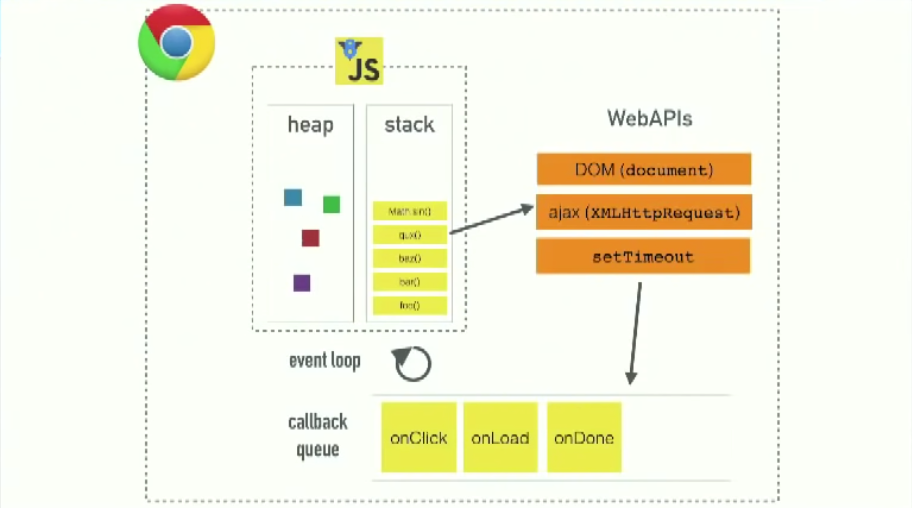

You may have heard that JavaScript is a “single threaded” language, which is true (well technically it’s the JS engine that is single-threaded, not the language itself - but that's not important for our purposes). More specifically, this means that the JavaScript engine has only one call stack and therefore can only execute and compile one thing at a time.

Let's first answer the obvious question - what’s a call stack?

In simple terms, t**he call stack keeps track of function calls. When a function is called, it’s pushed onto the stack. When it completes, it’s popped off the stack.**

Okay, so if the JS engine can only handle one thing at a time, what happens if that thing is slow or “blocking” or just never completes - like an API call, for example.

Luckily, the browser is more than just a runtime. It also provides a number of handy Web APIs that allow us to boot things off the stack so that the rest of our code can continue executing.

<div class="callout info">
<strong>✋ HOLD UP:</strong> Before we talk about Web APIs, let’s answer an important question: 
<strong>Why is slow code so bad?</strong> Well, browsers try to render/re-paint the screen every 16.6ms (60 frames/s). HOWEVER, it can't do a render if there's code on the stack. Picture a white button with a blue hover state. If you have slow code holding up the stack (like a long for loop), the <code>:hover</code> styles will be delayed because the render/re-paint is blocked. Once the stack is clear, a render will occur (highest priority) and THEN anything in the event queue will get pushed onto the stack. This results in a terrible user experience becuase it hinders the browser's ability to create nice fluid UI via renders/re-paints.
</div>

Okay, back to Web APIs. Let’s look at one of the most common ones - `setTimeout()`.
Consider the following code. What will the console logs look like?

```javascript
console.log('hi');
setTimeout(() => console.log('everyone'), 5000);
console.log('there');
```

Chances are you know the answer is:

```bash
hi
there
everyone
```

But what’s actually happening?

Well, we’re harnessing the power of asynchronous callbacks! Essentially, the function we passed to `setTimeout()` kicks off a 5 seconds timer in the browser, allowing the call to `setTimeout()` to be removed from the stack because it’s done its job. Without asynchronous callbacks, the execution of our code would pause for 5 seconds and our site would be completely unresponsive.

Now, what happens when that timer goes off? This is where things get interesting.

You might think (as I first did) that the callback function immediately gets pushed onto the stack and executed. The problem with that is there may be other code still running and we certainly don’t want these Web APIs randomly pushing code onto the stack. Instead, this is where the **task queue** (or _callback queue_) comes in.

Once that timer completes, the callback gets moved to the task queue. If the stack is clear (i.e. no code is currently executing), the callback will be immediately pushed onto the stack. However, if the stack is not empty, the callback function simply hangs out in the queue until it is.

In our example, this means the callback we passed to `setTimeout()` is **not guaranteed** to execute after exactly 5 seconds because if the call stack is busy, it will remain in the event queue. As such, 5 seconds is simply the minimum amount of time before executing. Knowing this, can you intuit the purpose of a `setTimeout()` with a duration of 0? That’s right, it simply defers execution of the callback until the stack is clear.
So, after all that rambling, I still haven’t answered the title question - what is the event loop? Well, it’s simply the mechanism that continuously checks for an empty call stack and then pushes any items in the callback queue onto it. That’s it.
Here’s some pseudo code to drive it home:

```javascript
// Event Loop
while isNotEmpty(eventQueue) {
	if (callStackIsEmpty) {
		// pull out first item from event queue
		// push onto stack
		// follow the execution logic until call stack is empty
	}
}
```

If you want to learn even more, check out [this incredible talk](https://www.youtube.com/watch?v=8aGhZQkoFbQ). I've watched it multiple times and I still somehow learn something new each time.

I'll leave you with an image I pulled from that talk which nicely sums up everything we just discussed:


